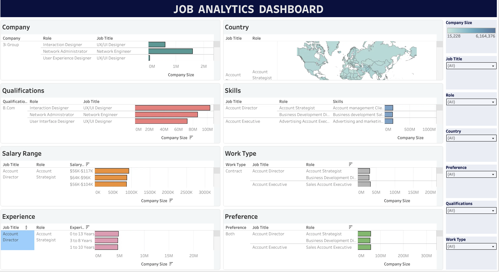
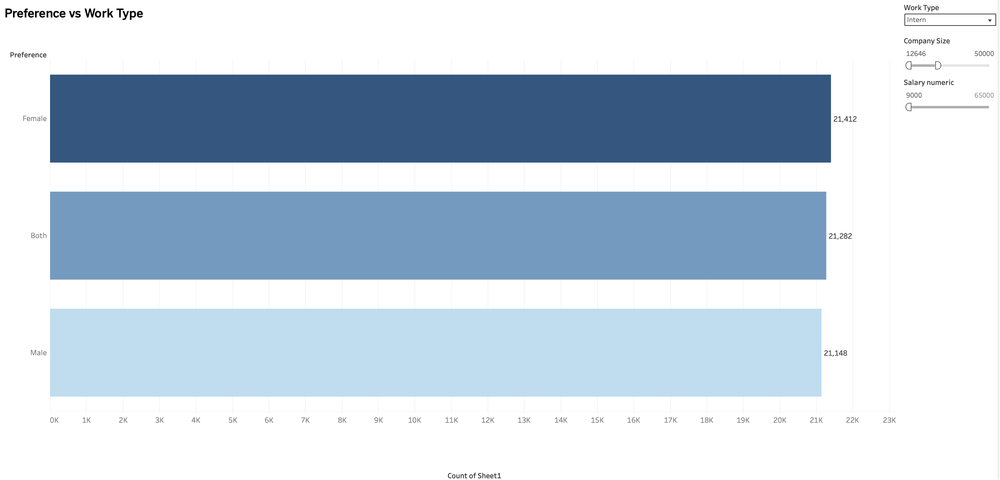
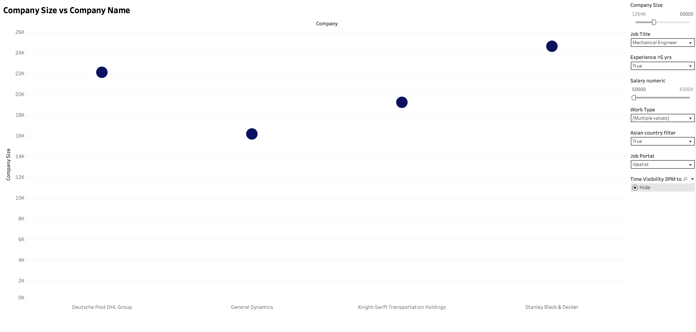
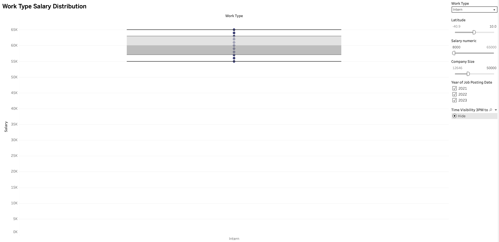
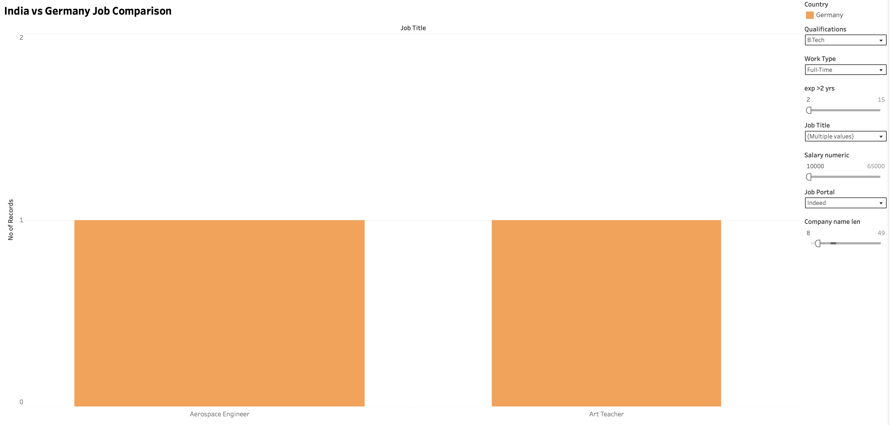
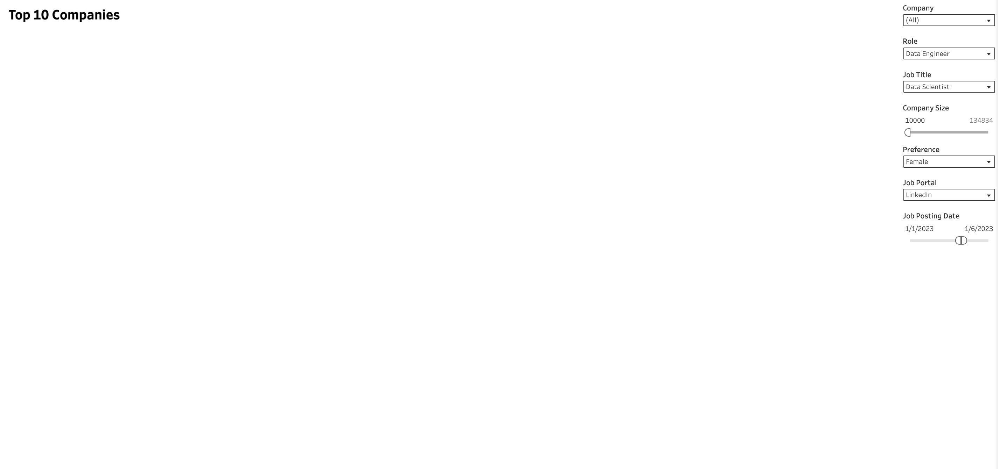
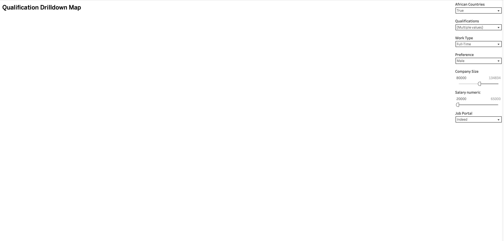

# Job Analytics Internship Project

## Overview

This project was developed as part of the **ElevanceSkills Data Analytics Internship Program** using **Tableau Public**. The objective was to extend the original Job Analytics Dashboard created during training and implement six additional analytical tasks using advanced Tableau concepts such as calculated fields, filters, parameters, drilldowns, and interactive visualizations.

The dashboard enables users to explore job market trends, hiring preferences, salary distributions, company insights, qualification requirements, and geographic job distributions through interactive analytics.

---

## Project Access

### Live Project Website

🔗 https://jobxanalytics.netlify.app

### Tableau Public Dashboard

🔗 https://public.tableau.com/shared/86KZQ2GX9?:display_count=n&:origin=viz_share_link

---

## Repository Structure

```text
job_analytics/
│
├── data_cleaning/
│   └── data_clean.ipynb
│
├── images/
│   ├── dashboard.png
│   ├── task1.png
│   ├── task2.png
│   ├── task3.png
│   ├── task4.png
│   ├── task5.png
│   └── task6.png
│
├── website/
│   ├── index.html
│   └── Job Analytics Internship Project.webloc
│
└── README.md
```

---

## Dashboard Preview



The dashboard combines all analytical views into a single interactive interface, allowing users to filter and explore job market trends, salary distributions, qualifications, company insights, and geographic hiring patterns.

---

## Task Visualizations

### Task 1 – Preference vs Work Type



### Task 2 – Company Size vs Company Name



### Task 3 – Work Type Salary Distribution



### Task 4 – India vs Germany Job Comparison



### Task 5 – Top Companies Hiring



### Task 6 – Qualification Drilldown Map



---

## Tools & Technologies

- Tableau Public
- Microsoft Excel
- Calculated Fields
- Interactive Filters
- Parameters
- Geographic Mapping
- Drilldown Functionality
- Dashboard Design

---

## Skills Demonstrated

- Data Visualization
- Dashboard Design
- Interactive Filtering
- Calculated Fields
- Geographic Analysis
- Drilldown Mapping
- Business Intelligence
- Data Analysis

---

## Internship Tasks

### 1. Preference vs Work Type

**Visualization:** Bar Chart

#### Filters Applied

- Work Type = Intern
- Company Size < 50,000
- Salary > $9,000

#### Key Insights

- Female-preferred internships recorded the highest number of postings (21,412).
- Both-gender opportunities followed closely (21,282).
- Male-preferred internships accounted for 21,148 postings.
- The difference between categories was minimal, indicating a balanced distribution of hiring preferences.
- Internship opportunities appeared relatively inclusive across all preference categories.

---

### 2. Company Size vs Company Name

**Visualization:** Scatter Plot

#### Filters Applied

- Job Title = Mechanical Engineer
- Experience > 5 Years
- Salary > $50,000
- Work Type = Full-Time or Part-Time
- Preference = Male
- Company Size < 50,000
- Asian Countries only (excluding countries starting with "I")
- Job Portal = Idealist
- Company Name contains at least two vowels
- Visible between 3 PM and 5 PM IST

#### Key Insights

- Stanley Black & Decker had the largest company size among the qualifying records.
- Deutsche Post DHL Group ranked second in company size.
- General Dynamics and Knight-Swift Transportation Holdings also met all filtering criteria.
- Only four companies satisfied all business rules, highlighting the restrictive nature of the applied filters.
- Hiring opportunities were concentrated among large established organizations.

---

### 3. Work Type Salary Distribution

**Visualization:** Box-and-Whisker Plot

#### Filters Applied

- Work Type = Intern
- Latitude < 10
- Company Size < 50,000
- Salary > $8,000
- Single-word Job Title with fewer than 10 characters
- Experience is an even number
- Posting Date between 2021 and 2023
- Contact Person name contains the letter "e"
- Visible between 3 PM and 5 PM IST

#### Key Insights

- Internship salaries ranged approximately between $55,000 and $65,000.
- The median salary was close to $60,000.
- Most salaries were concentrated within a narrow range, indicating low variability.
- No significant salary outliers were observed.
- Compensation appeared relatively standardized across qualifying internship postings.

---

### 4. India vs Germany Job Comparison

**Visualization:** Stacked Bar Chart

#### Filters Applied

- Qualification = B.Tech
- Work Type = Full-Time
- Experience > 2 Years
- Job Titles:
  - Data Scientist
  - Aerospace Engineer
  - Art Teacher
- Salary > $10,000
- Job Portal = Indeed
- Company Name length greater than 8 characters
- Location not empty

#### Key Insights

- Germany generated qualifying records under the selected conditions.
- Aerospace Engineer and Art Teacher roles appeared in the filtered dataset.
- No matching records were found for India after applying all filtering conditions.
- The analysis demonstrates how strict business rules can significantly reduce available records within a dataset.

---

### 5. Top Companies Hiring

**Visualization:** Tree Map

#### Filters Applied

- Role = Data Engineer
- Job Title = Data Scientist
- Non-Asian Countries
- Countries not starting with "C"
- Company Size ≥ 10,000
- Qualification = B.Tech
- Preference = Female
- Job Portal = LinkedIn
- Posting Date between 01/01/2023 and 06/01/2023
- Visible between 3 PM and 5 PM IST

#### Data Constraint

The task required the **Contact Person's Name to end with a vowel**. This requirement was implemented as a calculated filter and added to the dashboard filter panel. However, when this filter is selected, no records remain in the dataset and the treemap becomes blank.

To maintain a visible visualization, the filter is not enabled by default. Users can manually select the filter from the dashboard panel to validate the task requirement and observe the dataset limitation.

#### Key Insights

- DISH Network recorded the highest number of qualifying postings.
- Gilead Sciences, Halliburton, and Iluka Resources also appeared in the results.
- Only four companies satisfied the final filtering criteria.
- Hiring activity was concentrated among a small number of large organizations.
- The strict filtering conditions significantly reduced the available company pool.

---

### 6. Qualification Drilldown Map

**Visualization:** Interactive Drilldown Map

#### Filters Applied

- African Countries
- Qualification = B.Tech, M.Tech, or PhD
- Work Type = Full-Time
- Job Title starts with "D"
- Preference = Male
- Company Size > 80,000
- Salary > $20,000
- Contact Person name starts with "A"
- Visible between 3 PM and 6 PM IST

#### Data Constraint

The task required the **Job Portal to be Indeed**. This condition was implemented and included in the dashboard filter panel. However, selecting the Indeed filter together with all other task requirements produces no matching records in the dataset, causing the map visualization to become blank.

To preserve the visualization, the filter is available within the dashboard panel but is not selected by default. Users may apply the filter themselves to verify the requirement and validate the dataset constraint.

#### Key Insights

- Qualifying job postings were distributed across multiple African regions.
- Opportunities appeared across West, East, Central, and Southern Africa.
- Large organizations showed demand for highly qualified professionals.
- The geographic distribution suggests demand is spread across multiple African markets rather than concentrated in a single location.
- Drilldown functionality enables users to move from a country-level view to exact job locations for deeper analysis.

---

## Overall Findings

- Internship opportunities demonstrated a balanced distribution of hiring preferences.
- Large multinational organizations dominated experienced Mechanical Engineer recruitment.
- Internship salaries remained relatively standardized with limited variation.
- Germany generated qualifying opportunities under the specified comparison criteria, while no matching records were available for India.
- Data Scientist hiring activity was concentrated among a small number of large organizations.
- Demand for highly qualified professionals was distributed across several African regions.
- Interactive filters and drilldown functionality enhanced data exploration and user engagement.
- Dataset limitations were identified and documented transparently through optional validation filters available within the dashboard.

---

## Conclusion

This project demonstrates the practical application of Tableau for interactive dashboard development, business intelligence reporting, geographic analysis, filtering techniques, and data-driven decision-making. The implementation successfully completed all six internship tasks while documenting dataset constraints and providing meaningful analytical insights through interactive visualizations.
